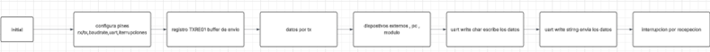

[](https://classroom.github.com/online_ide?assignment_repo_id=19677825&assignment_repo_type=AssignmentRepo)
# Lab04: Comunicación UART en PIC18F45K22

La comunicación UART (Transmisor-Receptor Asíncrono Universal) es un protocolo serie que permite la transmisión y recepción de datos de manera asíncrona, es decir, sin necesidad de una señal de reloj compartida. El microcontrolador PIC18F45K22 cuenta con un módulo EUSART (Enhanced Universal Synchronous Asynchronous Receiver Transmitter), que facilita la implementación de UART con configuraciones flexibles y eficiencia en aplicaciones embebidas

## Integrantes

[Johan David Romero Usaquer](https://github.com/johandavid24)
[Diego Alejandro Espindola Fonseca](https://github.com/diego202005)

## Documentación

MAIN .C#include <xc.h>
#include "uart.h"

#pragma config FOSC = INTIO67  // Oscilador interno
#pragma config WDTEN = OFF     // Watchdog Timer apagado
#pragma config LVP = OFF       // Low Voltage Programming off


void main(void) {
    OSCCON = 0b01110000;  // Oscilador interno a 16MHz
    UART_Init();          // Inicializa UART

    while(1) {
        UART_WriteString("Hola, UART funcionando!\r\n");
        __delay_ms(1000); 
    }
}
UART.C 
#include <xc.h>
#include "uart.h"

#pragma config FOSC = INTIO67  // Oscilador interno
#pragma config WDTEN = OFF     // Watchdog Timer apagado
#pragma config LVP = OFF       // Low Voltage Programming off


void main(void) {
    OSCCON = 0b01110000;  // Oscilador interno a 16MHz
    UART_Init();          // Inicializa UART

    while(1) {
        UART_WriteString("Hola, UART funcionando!\r\n");
        __delay_ms(1000); 
    }
}
#ifndef UART_H
#define UART_H

#include <xc.h>
#include <stdint.h>

#define _XTAL_FREQ 16000000UL    

void UART_Init(void);
void UART_WriteChar(char data);
void UART_WriteString(const char* str);
void UART_WriteUInt(uint16_t value);
void UART_WriteVoltage(uint16_t adcValue);

#endif
Descripción del código UART
Este código que estamos viendo tiene como objetivo configurar y manejar la comunicación UART en un microcontrolador PIC, que es una de las formas más comunes que tenemos para comunicar nuestro microcontrolador con otros dispositivos, como una computadora, un módulo Bluetooth o incluso otro microcontrolador.
La UART (Transmisor-Receptor Asíncrono Universal) nos permite enviar y recibir datos de forma serie usando solo dos líneas: una para transmitir (TX) y otra para recibir (RX). Con este tipo de comunicación podemos hacer muchas cosas: monitorear sensores, enviar datos a una interfaz gráfica, recibir comandos desde el computador, entre muchas otras aplicaciones.
________________________________________
¿Cómo está organizado el código?
Tenemos dos archivos principales:
●	uart.h: donde declaramos las funciones que vamos a usar y definimos algunos parámetros importantes.

●	uart.c: donde realmente implementamos lo que cada función hace.

________________________________________
Revisando el archivo uart.h
En este archivo lo primero que hacemos es incluir algunas librerías esenciales como <xc.h> (para tener acceso a los registros del microcontrolador) y <stdint.h> (para usar tipos de datos más específicos como uint16_t).
También definimos la frecuencia del oscilador con la línea #define _XTAL_FREQ 16000000UL. Esto es importante porque nos permite calcular correctamente la velocidad del puerto serial (baud rate), además de que es necesaria si queremos usar retardos (__delay_ms, por ejemplo).
Después, declaramos las funciones que vamos a implementar en el archivo .c. En este caso, son:
●	UART_Init(): que se encarga de inicializar todo lo necesario para que la UART funcione.

●	UART_WriteChar(char data): que envía un solo carácter por el puerto.

●	UART_WriteString(const char* str): que envía una cadena de caracteres.

●	También hay otras dos funciones declaradas pero que todavía no implementamos: UART_WriteUInt() y UART_WriteVoltage(). La idea detrás de estas funciones es que podríamos usarlas para enviar valores numéricos o voltajes leídos con el ADC, algo muy útil cuando trabajamos con sensores.

________________________________________
Ahora veamos el archivo uart.c
Acá es donde está la lógica real de cada función.
La función UART_Init()
Lo que hacemos aquí es preparar todos los registros del PIC para que la UART funcione correctamente. Paso a paso, hacemos lo siguiente:
1.	Configuramos los pines:

○	El pin TX (transmisión) lo ponemos como salida (TRISC6 = 0).

○	El pin RX (recepción) lo dejamos como entrada (TRISC7 = 1).

2.	Definimos la velocidad de transmisión (baud rate) en 9600 bits por segundo, que es un valor bastante estándar y que funciona bien con muchos dispositivos. Para lograrlo:

○	Usamos un generador de 8 bits (BAUDCON1bits.BRG16 = 0).

○	Usamos baja velocidad (TXSTA1bits.BRGH = 0).

○	Establecemos el registro SPBRG1 en 25, que es el valor necesario para 9600 baudios cuando el reloj es de 16 MHz.

3.	Habilitamos el módulo UART:

○	Activamos el puerto serial con RCSTA1bits.SPEN = 1.

○	Ponemos el módulo en modo asíncrono (TXSTA1bits.SYNC = 0).

○	Habilitamos tanto la transmisión (TXSTA1bits.TXEN = 1) como la recepción (RCSTA1bits.CREN = 1).

4.	Finalmente, dejamos lista la UART para trabajar con interrupciones. Esto significa que el microcontrolador puede "enterarse" automáticamente cuando llega un dato por RX sin tener que estar revisando constantemente:

○	Activamos la interrupción de recepción (PIE1bits.RC1IE = 1).

○	Limpiamos la bandera de interrupción (PIR1bits.RC1IF = 0).

○	Habilitamos tanto las interrupciones periféricas como las globales (PEIE = 1, GIE = 1).

Aunque por ahora no tenemos escrita la rutina de interrupción, ya dejamos todo listo para usarla más adelante si queremos.
________________________________________
La función UART_WriteChar(char data)
Esta función nos permite enviar un solo carácter por el puerto serial. Lo que hacemos es esperar hasta que el buffer de transmisión esté libre (TXSTA1bits.TRMT en 1), y luego escribimos el dato en TXREG1, que es el registro encargado de enviar el dato por el pin TX.
________________________________________
La función UART_WriteString(const char* str)
Esta función es muy útil cuando queremos enviar mensajes completos. Recibe como parámetro una cadena de texto (por ejemplo "Hola mundo") y va enviando cada carácter uno por uno usando la función UART_WriteChar().
Así, podemos ver mensajes desde una terminal serial en el computador o desde un monitor serial en una aplicación.


## Implmentación


### 🎯 **Objetivo**

Configurar e implementar una comunicación UART funcional en el microcontrolador **PIC18F45K22**, permitiendo la transmisión periódica de mensajes de texto hacia un dispositivo externo (por ejemplo, una PC) a través de un terminal serial.

---

### 🗂️ **Estructura del Proyecto**

El proyecto está organizado en tres archivos principales:

* **`main.c`**: contiene el programa principal, donde se inicializa el sistema y se ejecuta el bucle principal que envía mensajes por UART cada segundo.
* **`uart.c`**: contiene la implementación de las funciones relacionadas con la UART.
* **`uart.h`**: define las funciones públicas y constantes necesarias para manejar la UART.

---

### ⚙️ **Configuración del Sistema**

* **Oscilador interno** configurado a 16 MHz mediante el registro `OSCCON`.
* UART configurada para operar a **9600 baudios**, con configuración de 8 bits de datos, sin paridad y 1 bit de parada (formato 8N1).
* Pines:

  * **TX**: RC6 (salida)
  * **RX**: RC7 (entrada)

---

### 📄 **Detalle de los Archivos**

#### `main.c`

Se inicializa el sistema y se llama a `UART_Init()`. Dentro del bucle principal, se utiliza `UART_WriteString()` para enviar un mensaje cada segundo:

```c
UART_WriteString("Hola, UART funcionando!\r\n");
__delay_ms(1000);
```

---

#### `uart.h`

Contiene las declaraciones de las funciones UART, además de definir la frecuencia del oscilador:

```c
#define _XTAL_FREQ 16000000UL
void UART_Init(void);
void UART_WriteChar(char data);
void UART_WriteString(const char* str);
void UART_WriteUInt(uint16_t value);
void UART_WriteVoltage(uint16_t adcValue);
```

---

#### `uart.c`

Implementa las funciones declaradas en el header. La inicialización configura:

* `TRISC6 = 0` → TX como salida.
* `TRISC7 = 1` → RX como entrada.
* `SPBRG1 = 25` para 9600 baudios con `Fosc = 16MHz`.
* UART habilitada en modo asíncrono, transmisión y recepción activadas.

**Ejemplo:**

```c
void UART_Init(void) {
    TRISC6 = 0;
    TRISC7 = 1;
    BAUDCON1bits.BRG16 = 0;
    TXSTA1bits.BRGH = 0;
    SPBRG1 = 25;
    TXSTA1bits.SYNC = 0;
    RCSTA1bits.SPEN = 1;
    TXSTA1bits.TXEN = 1;
    RCSTA1bits.CREN = 1;
}
```

La función `UART_WriteChar()` espera a que el buffer esté libre y luego transmite un carácter:

```c
void UART_WriteChar(char data) {
    while (!TXSTA1bits.TRMT);
    TXREG1 = data;
}
```

`UART_WriteString()` recorre una cadena y envía carácter por carácter:

```c
void UART_WriteString(const char* str) {
    while (*str) {
        UART_WriteChar(*str++);
    }
}
```

---

### 🔄 **Posibilidades de Expansión**

Aunque el código actual solo transmite mensajes, está preparado para:

* Enviar valores numéricos (`UART_WriteUInt()`).
* Enviar voltajes medidos con el ADC (`UART_WriteVoltage()`).
* Manejar interrupciones de recepción (bandera y habilitación están listas).
* Implementar recepción de cadenas.

---

### 🧪 **Prueba y Verificación**

La comunicación se puede probar conectando el microcontrolador a una PC mediante un convertidor USB-TTL. En un software terminal (como PuTTY, RealTerm o TeraTerm), se puede visualizar el mensaje enviado cada segundo, confirmando que la UART está operando correctamente.

DIAGRAMA DE FLUJO

